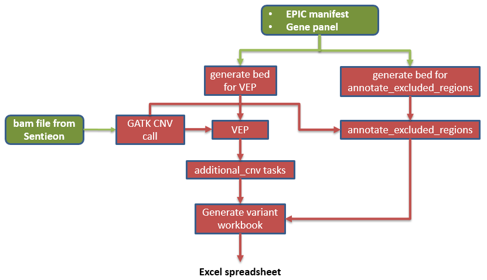

# dias_cnv_nf

`dias_cnv_nf` workflow is to run after `dias_nextflow`. The workflow requires bam and bam.bai output files from Sentieon from `dias_nextflow` as well as epic_menifest file downloaded from EPIC to get the Rcode for each samples.
 
The workflow has the processes to 
- run GATK CNV caller
- generate bed file for Vep
- generate bed file for annotate_excluded_regions
- run Vep tool
- run additional_cnv_tasks
- run annotate_excluded_regions
- generate variant workbook - spreadsheet

### Tools and version used in the workflow
- bcftools-1.18
- bedtools-2.29.1
- tabix-0.2.6
- bgzip-0.2.6
- generate_variant_book [(v2.4.0)](https://github.com/eastgenomics/eggd_generate_variant_workbook/releases)

### nextflow.config
Contains all nextflow parameters used in different processes
### main.nf
Calls the modules and runs workflows
### nextflow_schema.json
Defines the parameter type for DNAnexus parameters
### modules
Contains modules for all processes 
### bin folder
Contains all the source codes/tools
### inputs.json
This file contains parameters which are defined as DNAnexus parameters and is required to run the nextflow applet. It is not required for building applet.
NOTE: `nextflow_pipeline_params` in `inputs.json` file is default to project with test samples;therefore, need to change the respective dir for each run. 

### To build dias_cnv_nf on DNAnexus
```
 git clone <repo>
 dx select <DNAnexus project>
 dx build --nextflow (inside the cloned folder)
 ```
 
 ### To run the built dias_nextflow applet on DNAnexus 
```
dx run applet-xxxx \
-f /local/path/to/json/file/inputs.json
```

